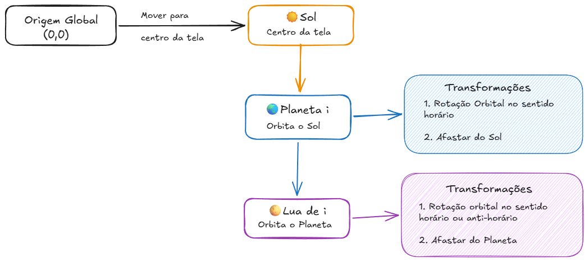

# Atividade sistema Solar

Atividade Prática – Sistema Solar com Planetas e Luas

> Integrantes: Isaac Lívi dos Santos e Lucas Vezaro Tonolli

## Etapa 1

## Etapa 2

- O método `draw()` é executado em loop, chamando `update()` para cada planeta. Cada um deles atualiza seu próprio theta e então chama o `update()` da sua respectiva lua.
- A variável _theta_ é incrementada ou decrementada dentro do método `update()` de ambas as classes, através da instrução `theta += orbitspeed;`.
- `orbitspeed` controla o quanto `theta` avança por quadro — quanto maior o valor absoluto, mais rápida a volta completa.
- A classe _Planet_ define sua _orbitspeed_ sempre com valores positivos, variando de 0.01 a 0.03, enquanto a classe _Moon_ possui uma velocidade aleatória entre -0.1 e 0.1. Como o sistema de coordenadas do Processing tem o eixo Y apontando para baixo, valores positivos de rotação geram um movimento no sentido horário e valores negativos geram movimento no sentido anti-horário.

## Etapa 4

1. **Onde aplicamos pushMatrix()/popMatrix() e por quê?**

- No `draw()` do _SolarSystem_: salva o estado antes do `translate` para o centro, assim os planetas partem sempre do mesmo ponto.
- Em `Planet.display()` e `Moon.display()`: cada objeto salva e restaura o estado da matriz ao redor de suas próprias transformações, evitando que um planeta ou lua afete o posicionamento do seguinte.

2. **O que mudaria se invertêssemos rotate() e translate() no planeta ou na lua**

- Se trocarmos a ordem das transformações, o objeto deixa de orbitar o centro e passa a girar em torno do próprio eixo, pois primeiro é deslocado para uma posição fixa (`translate`) e depois rotacionado (`rotate`) nesse novo referencial.

3. **Como garantimos órbitas independentes?**

- Cada objeto tem seu próprio _theta_ e _orbitspeed_ (estado separado).
- O `update()` incrementa theta independentemente para cada planeta/lua.
- O `pushMatrix()/popMatrix()` salva e restaura o sistema de coordenadas entre objetos e garantem que os objetos calculem a partir de uma mesma origem, não a partir do ponto do registro anterior.
